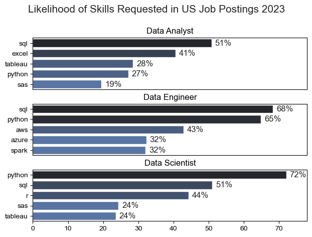
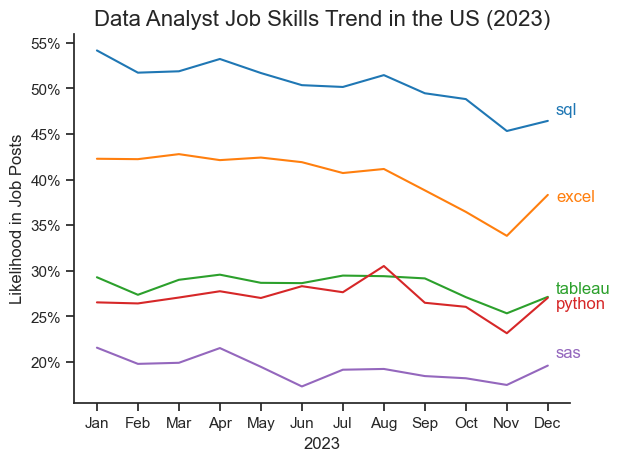
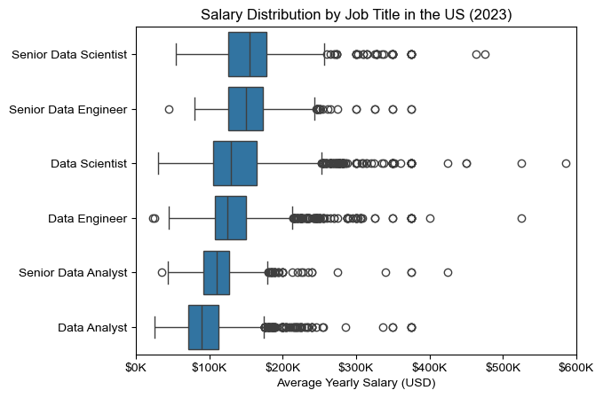
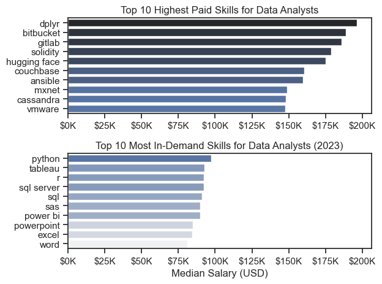
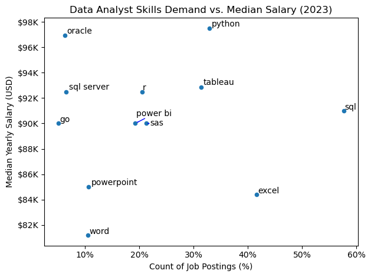
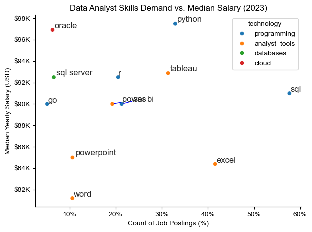

# Introduction

Welcome to my analysis of the data job market. This project was created out of a desire to sharpen my Python skills while also gaining a clearer understanding of the job market. Focusing mainly on data analysts, it dives into the highest-paying and most in-demand skills. The data was sourced from (link will be added), and I used it to analyze salary trends, high-demand technical skills, and what the optimal skills are to learn by intersecting salary and demand for data analytics job postings in 2023.

# The Questions

1. Which skills are most in demand for the top three data roles?

2. How are in-demand skills changing over time for Data Analysts?

3. What are the salary trends for Data Analysts and the skills they need?

4. Which skills offer the best balance of high demand and high pay for Data Analysts?

# Tools Used

- Pandas – data cleaning, transformation, and analysis

  - NumPy – numerical operations and efficient computation

  - Matplotlib – foundational data visualizations

  - Seaborn – more advanced and visually appealing plots

- Jupyter Notebook – running code interactively with notes and explanations

- Visual Studio Code – writing, running, and organizing Python scripts

- Git & GitHub – version control, project management, and sharing progress

- Anaconda – managing Python environments and dependencies

- conda & pip – installing and managing additional packages

# Analysis

## 1. What are the  most demanded skills for the top 3 most popular data roles?

To identify the most in-demand skills for the three most common data roles, I first determined which job titles appeared the most frequently. Then, for each of those roles, I pulled out the top five required skills. This gives a clear picture of which skills are most valuable for each role and helps me understand what to focus on depending on the career path I want to pursue.

View my notebook with detailed steps here: [2_Skill_Demand.ipynb](2_Project/2_Skill_Demand.ipynb)

### Visualize Data

```python
fig, ax = plt.subplots(len(job_titles), 1)

for i, job_title in enumerate(job_titles):
    df_plot = df_skills_perc[df_skills_perc['job_title_short'] == job_title].head(5)
    sns.barplot(data=df_plot, x='skill_percent', y='job_skills', ax=ax[i], hue='skill_percent', palette='dark:b_r', legend=False)

plt.show()
```

### Results



### Insights

- SQL remains the core skill for Data Analysts and Data Scientists, appearing in more than half of all job postings for both roles.

- Python is the top requirement for Data Engineers (68%) and is also highly demanded for Data Scientists (72%), showing its importance in more technical and modeling-focused roles.

- Data Engineers are expected to work with cloud and big-data technologies such as AWS, Azure, and Spark — tools not typically required for Data Analysts.

- Data Analysts rely more on business-focused tools like Excel and Tableau, reflecting their emphasis on data reporting and visualization.

- Across all roles, Python and SQL form the core skill set, while specialization depends on the role’s focus — engineering, analysis, or advanced modeling.

## 2. How are in-demand skills trending for Data Analysts?

### Visualize Data

```python

from matplotlib.ticker import PercentFormatter
df_plot = df_DA_US_percent.iloc[:, :5]

sns.lineplot(data=df_plot, dashes=False, palette='tab10')

plt.gca().yaxis.set_major_formatter(PercentFormatter(decimals=0))

plt.show()

```

### Results



### Insights

- SQL and Excel remain the most in-demand skills for Data Analysts throughout 2023, but both show a gradual decline—especially Excel toward the end of the year.

- Python and Tableau maintain mid-level demand, with Python seeing a slight rise in late summer before dipping again, while Tableau stays relatively steady.

- SAS consistently shows the lowest demand, and continues a slow downward trend, suggesting reduced market emphasis on legacy analytics tools.

## 3. How well do jobs and skills pay for Data Analysts in the US?

### Visualize Data

```python

df_US_top6 = df_US[df_US['job_title_short'].isin(job_titles)]

sns.boxplot(data=df_US_top6, x='salary_year_avg', y='job_title_short', order=job_order)

plt.gca().xaxis.set_major_formatter(ticks_x)
plt.show()

```

### Results



### Insights

- Salary ranges vary widely across data roles. Senior Data Scientist positions show the highest earning potential — reaching up to around $600K — reflecting the premium placed on advanced expertise and experience.

- Senior Data Scientist and Senior Data Engineer roles have many high-end outliers, meaning standout talent or specialized skills can lead to significantly higher pay. Meanwhile, Data Analyst salaries are more consistent with fewer extreme values.

- Median salaries rise with both seniority and specialization. Senior roles not only earn more on average but also show greater variation in pay, highlighting the broader range of responsibilities and compensation at higher career levels.

### Highest Paid and Most Demanded Skills for Data Analysts in US

### Visualize Data

```python

fig, ax = plt.subplots(2, 1)

sns.barplot(data=df_DA_top_pay, x='median', y=df_DA_top_pay.index, ax=ax[0], hue='median', palette='dark:b_r')

sns.barplot(data=df_DA_skills, x='median', y=df_DA_skills.index, ax=ax[1], hue='median', palette='light:b')

plt.tight_layout()
plt.show()
```

### Results



### Insights

- The top chart shows that specialized technical skills—such as dplyr, Bitbucket, and GitLab—are linked with higher salary ranges, in some cases approaching $200K, indicating strong earning potential for advanced technical capabilities.

- The bottom chart highlights that foundational skills like Excel, SQL, and PowerPoint remain the most widely required in job postings, even though they are not associated with the highest salaries.

- Overall, the data reveals a clear divide between the skills that pay the most and those that are most in demand. Data analysts who combine essential foundational skills with higher-paying technical expertise are best positioned to maximize both job opportunities and compensation.


## 4. What is the optimal skill to learn for Data Analysts?

### Visualize Data

```python

from adjustText import adjust_text

df_DA_skills_high_demand.plot(kind='scatter', x='skill_percent', y='median_salary')

plt.tight_layout()
plt.show()

```

### Results



### Insights

- Skills like **Python, Oracle, and SQL Server** are linked to the **highest median salaries**, suggesting that stronger technical expertise can significantly boost earning potential.
- **SQL and Excel** appear in the **largest share of job postings**, showing that employers still highly value core, foundational data skills for Data Analyst roles.


### Optimal Skills for Data Analysts colored by Technology

### Visualize Data

```python

from adjustText import adjust_text

sns.scatterplot(data=df_plot, x='skill_percent', y='median_salary', hue='technology')

plt.tight_layout()
plt.show()

```

### Results



### Insights

- **Programming and database skills** like **Python, SQL Server, and Oracle** generally lead to higher salary opportunities, emphasizing the value of more advanced technical capabilities.

- **Analyst tools** such as **Excel and Power BI** remain highly in demand, reinforcing that employers expect Data Analysts to balance actionable business tools with deeper technical skills.

# What I Learned

I strengthened my technical skills in Python, especially in data cleaning and visualization. I learned that thoroughly understanding and preparing the data before analysis is the most crucial step to getting accurate and meaningful insights. I also gained a deeper understanding of how to use Python libraries such as Pandas, Seaborn, and Matplotlib effectively. My visualization abilities improved as well, helping me better communicate findings and answer the questions driving this project.

# Insights

Through this project, I discovered several key insights about the tech job market; especially related to data analytics careers:

- I learned which skills are most optimal to prioritize by combining both demand and compensation data.

- Salary ranges can vary significantly depending on domain-specific skills such as cloud technologies, programming languages, and machine learning.

- Data analysts with a wider and more modern technical skill set tend to have more earning potential and job opportunities.

# Conclusion

This project has sparked an even stronger interest in data analysis, especially in the visualization side of it. The skills I developed throughout this course have given me a solid foundation to continue growing in the data field. Moving forward, I’m excited to keep learning, expanding my skill set, and staying up to date with industry trends.